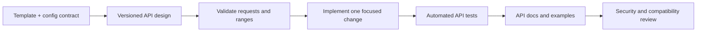

# API implementation skill

Use this guidance when creating, changing, reviewing, or documenting an API in this repository.

## Goal

Keep the API portable, predictable, safe, and easy for another project or agent to consume. The API is an adapter around the Markdown templates and `config/post-dynamic-ranges.json`, preserving the repository’s canonical template contract.

## Design the contract first

- Write or update the request, response, error, and lifecycle contract before changing handlers.
- Use a versioned path such as `/v1/...` and evolve response shapes through explicit versioning.
- Describe the public API in an OpenAPI document before the API grows beyond a few endpoints. OpenAPI is a language-agnostic description format intended to let people and tools understand an HTTP API without source-code access.
- Use standard HTTP methods and meaningful HTTP status codes. Keep successful results, invalid requests, missing sessions/resources, and unexpected server failures distinguishable.

## Apply the project contract

- Read `templates/post-core.md`, the selected extension, and `config/post-dynamic-ranges.json` before changing API behavior.
- Direct composition accepts a post type and a complete or partial configuration override, then resolves and validates it against the selected profile.
- Guided composition returns one question at a time. Its answer sequence must stay documented, deterministic, and resumable within a session.
- Keep the fixed rule that tags have a count of exactly ten.
- Return the resolved configuration with the generated template so callers can inspect the effective ranges.
- Guided sessions use signed, short-lived tokens so they work across Vercel Function invocations without a database. If long-lived sessions or server-side state are required, add an explicit persistent store and expiry policy.

## Validate at the boundary

- Parse request bodies defensively and set a size limit.
- Validate types, required fields, allowed post types, and every `min`/`max` range before composing a template.
- Reject unknown configuration keys rather than silently ignoring them.
- Return a stable JSON error object with a helpful client-safe message and share only the information needed for client recovery.

## Security before exposure

- Treat all external input as untrusted.
- Before publishing the API, choose authentication and authorization rules, restrict CORS to intended origins, add rate limits, and log security-relevant failures without logging secrets or unnecessary personal data.
- Check object and session access whenever sessions become user-owned or persisted, using authenticated authorization context.
- Keep dependencies current and review changes against the OWASP API Security Top 10.

## Test and document every change

- Test the happy path, invalid input, range boundaries, fixed ten-tag rule, unknown resources, and guided-session completion.
- Preserve backward compatibility where practical; introduce a new API version for incompatible changes.
- Update `docs/API.md`, examples, and diagrams in the same change as endpoint behavior.
- Run `bun test` before committing an API change.

## Primary references

- [OpenAPI Specification](https://spec.openapis.org/oas/) — API description format and current published versions.
- [RFC 9110: HTTP Semantics](https://www.rfc-editor.org/rfc/rfc9110.html) — HTTP methods, semantics, and status-code standard.
- [MDN: HTTP response status codes](https://developer.mozilla.org/en-US/docs/Web/HTTP/Reference/Status) — practical status-code reference.
- [OWASP API Security Top 10](https://owasp.org/API-Security/) — common API security risks and mitigation guidance.
