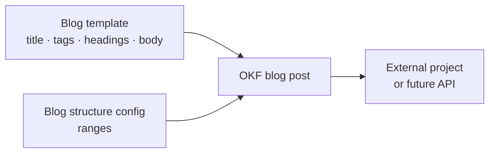
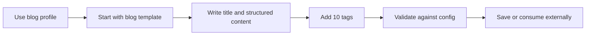

# Reusable Marketing Post Templates

This project defines a portable, Open Knowledge Format (OKF) template system for creating long-form product-marketing blog posts. Blog posts are the active product scope. The earlier social-media material is preserved as deferred reference work and will be redesigned independently later.

The repository is currently a template and documentation baseline. It does not yet generate, publish, or serve posts through an API.

## How it works

The active authoring path is blog-first:



1. The blog template establishes the main title, ten tags, subtitles, and structured blog body.
2. The blog configuration profile defines ranges for title length, subtitle count and length, body length, body-section count, and tag count.
3. A consuming project fills the Markdown template and can validate the result against the blog profile.

The authoring contract focuses on the main title, post content, and exactly ten tags. How tags are created is outside the template contract.

The active blog structure is being refined through one canonical [SEO and AI-search specification](docs/BLOG-SEO-STRUCTURE.md): use its [visual human-readable view](docs/BLOG-SEO-STRUCTURE.md#human-readable-view) for planning and its [agent-operating view](docs/BLOG-SEO-STRUCTURE.md#agent-operating-view) for drafting and review. It prioritizes people-first answers, original evidence, clear authorship, and technical accessibility rather than unsupported AI-search shortcuts.

## Template layers

| File | Purpose |
|---|---|
| [`templates/blog-post.md`](templates/blog-post.md) | Active blog-post template direction. |
| [`config/post-structure.json`](config/post-structure.json) | Active blog profile and preserved deferred profile. |
| [`templates/post-core.md`](templates/post-core.md) | Preserved legacy shared scaffold; not active for new authoring. |
| [`templates/social-media-post.md`](templates/social-media-post.md) | Preserved deferred draft for a future independent design. |

The active blog profile requires 2,000–4,000 body words, 5–10 subtitles/sections, and exactly 10 tags.

These are configuration values, not hardcoded rules. They can be adjusted as the content strategy evolves.

## Typical workflow



1. Start with `templates/blog-post.md`.
2. Write the main title and structured blog content.
3. Provide exactly ten tags.
4. Check the post against the `blog` ranges in `config/post-structure.json`.
5. Save the result as an OKF Markdown concept in `posts/` or in an external consuming project.

## Repository structure

```text
post/
├── config/       structure profiles and ranges
├── templates/    shared core and channel extensions
├── posts/        completed OKF post concepts
├── AGENTS/       agent instructions
└── SPEC.md       OKF v0.2 specification
```

- `SPEC.md` — local copy of the Open Knowledge Format v0.2 specification.
- `config/` — configuration for structural ranges and profiles.
- `templates/` — active blog template direction, deferred material, and consumption guidance.
- `posts/` — reserved for completed post concepts.
- `AGENTS/` — instructions for agents researching, drafting, and reviewing posts.

## OKF and portability

Posts use UTF-8 Markdown with YAML frontmatter, following the local [`SPEC.md`](SPEC.md). The format is intentionally plain and portable: another project should be able to copy or retrieve the templates without importing private repository code.

The future integration direction is an API or adapter that can retrieve the canonical blog template and validate its structure. That API should expose this file-based contract rather than replace it. Social-media support will be reconsidered after the blog template is complete.

## API

The initial API is now available locally. It supports both a direct request with a post type and configuration, and a guided session that returns one configuration question at a time. See [`docs/API.md`](docs/API.md) for the endpoints, request flow, and local usage.

## Development status

The initial baseline and bonus API are complete. The active milestone is to finish a canonical, standalone blog template. Social-media template design, post-generation logic, authentication, custom domains, and publishing integrations remain future milestones.

## Tooling

Use [Bun](https://bun.sh/) for this repository’s package management, scripts, and tests. Do not use npm. Run the API with `bun run start` and the test suite with `bun test`. Startup uses local IPv4 port 3000 when available, otherwise the first free port through 3010. Open the printed local address in a browser to see the API discovery page.

For remote deployment, import the repository into Vercel. The included `vercel.json` configures Vercel’s Bun runtime, and the `api/` entrypoints use the same handler as the local server. See [`docs/API.md`](docs/API.md) for the Vercel setup and guided-session secret.

## Collaboration workflow

Repository work is integrated on `develop`. Changes are committed and pushed there incrementally. `main` is reserved for work that has been fully tested and verified.

## Upstream reference

The OKF specification was obtained from [GoogleCloudPlatform/knowledge-catalog](https://github.com/GoogleCloudPlatform/knowledge-catalog/blob/main/okf/SPEC.md).
