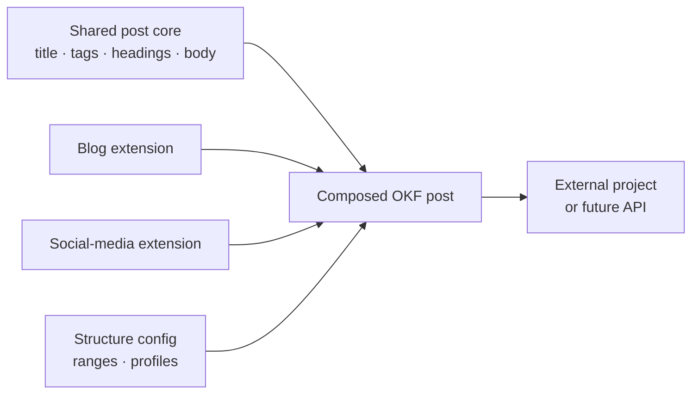
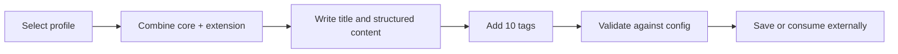

# Reusable Marketing Post Templates

This project defines a portable, Open Knowledge Format (OKF) template system for creating product-marketing posts. It supports both long-form blog posts and short-form social-media posts while keeping their shared content structure consistent.

The repository is currently a template and documentation baseline. It does not yet generate, publish, or serve posts through an API.

## How it works

Every post is composed from two layers:



1. The shared core establishes the main title, ten tags, subtitles, and structured post body.
2. One use-case extension adds the structure for either a blog post or a social-media post.
3. A configuration profile defines ranges for title length, subtitle count and length, body length, body-section count, and tag count.
4. A consuming project fills the Markdown template and can validate the result against the selected profile.

The authoring contract focuses on the main title, post content, and exactly ten tags. How tags are created is outside the template contract.

## Template layers

| File | Purpose |
|---|---|
| [`templates/post-core.md`](templates/post-core.md) | Shared structure required by every post. |
| [`templates/blog-post.md`](templates/blog-post.md) | Blog-specific extension of the shared core. |
| [`templates/social-media-post.md`](templates/social-media-post.md) | Social-media-specific extension of the shared core. |
| [`config/post-structure.json`](config/post-structure.json) | Configurable structural ranges and profiles. |

Current example profiles include:

- Blog: 2,000–4,000 body words and 5–10 subtitles/sections.
- Social media: 30–150 body words and 1–3 subtitles/content beats.
- Both: exactly 10 tags.

These are configuration values, not hardcoded rules. They can be adjusted as the content strategy evolves.

## Typical workflow



1. Select the blog or social-media profile.
2. Start with `templates/post-core.md` and apply the selected extension.
3. Write the main title and structured body content.
4. Provide exactly ten tags.
5. Check the post against the selected ranges in `config/post-structure.json`.
6. Save the result as an OKF Markdown concept in `posts/` or in an external consuming project.

## Repository structure

```text
post/
├── config/       structure profiles and ranges
├── templates/    shared core and channel extensions
├── posts/        completed OKF post concepts
├── AGENTS/       agent instructions
└── SPEC.md       OKF v0.2 specification
```

- `SPEC.md` — local copy of the Open Knowledge Format v0.2 specification.
- `config/` — configuration for structural ranges and profiles.
- `templates/` — shared core, channel extensions, and consumption guidance.
- `posts/` — reserved for completed post concepts.
- `AGENTS/` — instructions for agents researching, drafting, and reviewing posts.

## OKF and portability

Posts use UTF-8 Markdown with YAML frontmatter, following the local [`SPEC.md`](SPEC.md). The format is intentionally plain and portable: another project should be able to copy or retrieve the templates without importing private repository code.

The future integration direction is an API or adapter that can retrieve the core, retrieve a selected extension, compose a post, and validate its structure. That API should expose this file-based contract rather than replace it.

## API

The initial API is now available locally. It supports both a direct request with a post type and configuration, and a guided session that returns one configuration question at a time. See [`docs/API.md`](docs/API.md) for the endpoints, request flow, and local usage.

## Development status

This is the preparation phase. The current scope is templates, configuration, OKF guidance, and agent instructions. Post-generation logic, validation tooling, publishing integrations, and the external API will be added in later phases.

## Collaboration workflow

Repository work is integrated on `develop`. Changes are committed and pushed there incrementally. `main` is reserved for work that has been fully tested and verified.

## Upstream reference

The OKF specification was obtained from [GoogleCloudPlatform/knowledge-catalog](https://github.com/GoogleCloudPlatform/knowledge-catalog/blob/main/okf/SPEC.md).
