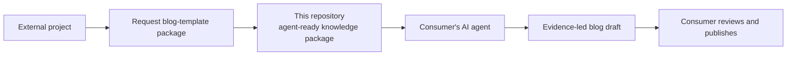
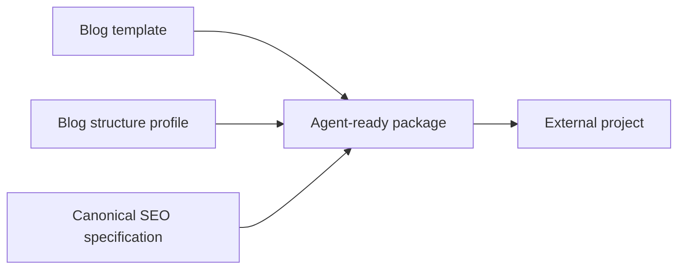
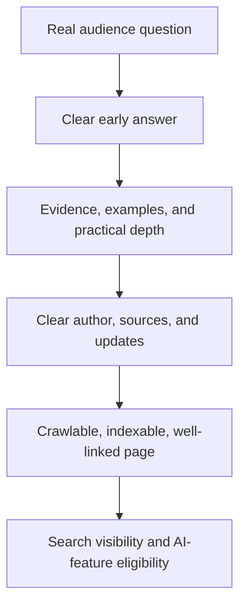
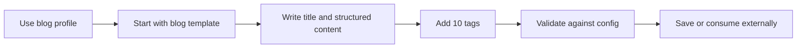

# Reusable Marketing Post Templates

This project defines a portable, Open Knowledge Format (OKF) knowledge package for creating long-form product-marketing blog posts. Blog posts are the active product scope. The earlier social-media material is preserved as deferred reference work and will be redesigned independently later.

The repository does not create or publish posts itself. Its primary consumer is an AI agent in another project: that agent requests this package to obtain the structure and instructions for a good-quality, SEO-ready blog post. A human-readable view is retained for understanding, review, and maintenance.

## Consumer model



### AI-agent-first response contract

Every response from this repository—whether delivered through an API, raw files, or a future export—must be optimized first for an AI agent: unambiguous, structured, versioned, and actionable. It must give the requesting agent everything it needs to create a quality blog post without guessing at the repository’s intent:

- active template and structural profile;
- required inputs, constraints, and conditional sections;
- drafting and review workflow;
- SEO and Google AI-search guidance grounded in sources;
- prohibited shortcuts and unsupported claims;
- a human-readable presentation of the same instructions for planning and approval.

Human readability must not introduce a second or conflicting contract. It is a clearer presentation of the agent-facing source of truth, not a separate template.

The API, raw repository files, or a future packaged export are delivery mechanisms for this same contract; they must not become competing sources of truth. The consumer remains responsible for its topic research, factual verification, publishing environment, and final publication decision.

## How it works

The active authoring path is blog-first:



1. The blog template establishes the main title, ten tags, subtitles, and structured blog body.
2. The blog configuration profile defines ranges for title length, subtitle count and length, body length, body-section count, and tag count.
3. The canonical specification supplies source-grounded drafting and review guidance.
4. A consuming AI agent receives these as one agent-ready package, uses them to create a draft, and can validate the result against the blog profile.

The authoring contract focuses on the main title, post content, and exactly ten tags. How tags are created is outside the template contract.

## Canonical blog SEO and AI-search specification

> **Single source of truth.** This README contains both the visual [human-readable view](#human-readable-view) and the concise [agent-operating view](#agent-operating-view) for the active blog-template milestone. It is working guidance, not yet the final template.

### Human-readable view

Create long-form blog posts that solve a real audience problem, can earn conventional Google Search visibility, and are eligible to be selected as supporting links in Google AI Overviews or AI Mode.

Google does not define a separate AI-Overview writing format and does not guarantee inclusion. Its AI features use core Search ranking and quality systems, so the durable strategy is helpful, original, technically accessible content—not AI-search tricks. See [Google’s AI-features guidance](https://developers.google.com/search/docs/appearance/ai-features) and [generative-AI optimization guide](https://developers.google.com/search/docs/fundamentals/ai-optimization-guide).



#### Recommended article structure

Keep only sections that genuinely help the reader; the template must not become filler.

| # | Section | What it must accomplish |
|---:|---|---|
| 1 | Search-intent brief | State the intended audience, their real question or problem, and the useful outcome this article promises. This is authoring context, not necessarily published copy. |
| 2 | Main title (`H1`) | Give the article one unique, clear, descriptive title that accurately represents its content. |
| 3 | Direct answer / key takeaway | Answer the central question clearly near the beginning, then explain the answer in depth. |
| 4 | Table of contents | Help readers navigate a long article; include it when the article has enough sections to benefit from it. |
| 5 | Question-led main sections (`H2`) | Organize the article around real sub-questions. Each section should answer its heading directly before adding explanation. |
| 6 | Original value | Provide first-hand experience, testing, concrete examples, proprietary data, screenshots, expert interpretation, or another contribution that is not a generic summary. |
| 7 | Evidence and sources | Support meaningful factual claims with reliable sources; distinguish facts, opinion, assumptions, and uncertainty. |
| 8 | Practical examples or steps | Show the reader how to apply the advice, evaluate options, or avoid common mistakes. |
| 9 | Relevant internal links | Link naturally to useful product, documentation, or related-content pages with descriptive anchor text. |
| 10 | Focused FAQ (optional) | Cover only genuine follow-up questions not already answered in the article. Three to five concise Q&As are usually enough when a FAQ is warranted. |
| 11 | Trust and maintenance information | Identify the author and relevant expertise, list a reviewer when appropriate, and show meaningful publication and update dates. |
| 12 | Related next steps | Point to relevant resources or deeper reading. A promotional CTA is optional and remains outside the current content contract. |

#### Useful practices

- Write for people first, with a clear audience and answer they can use.
- Make expertise visible through original work, careful sourcing, and transparent authorship.
- Use real questions as headings when they accurately describe the reader’s need.
- Keep important information as accessible text, supported by relevant images or video where they improve understanding.
- Publish pages that can be crawled and indexed, and connect them through logical internal links.

#### Unsupported shortcuts to avoid

- Do not write thin articles solely to capture search traffic.
- Do not keyword-stuff titles, headings, tags, or prose.
- Do not add invented FAQs merely to attract AI answers.
- Do not depend on `FAQPage` or `HowTo` markup for visibility. FAQ rich results are generally limited to authoritative government and health sites, and HowTo rich results are deprecated.
- Do not add `llms.txt`, special AI-only markup, or artificial micro-sections for Google AI features. Google says no special markup or machine-readable files are required.

Question-and-answer writing is valuable when it improves the article for readers. It is not a promise that Google will cite the page in an AI response.

#### Publishing requirements outside the Markdown template

The eventual publishing system should map this content to a well-formed web page with a concise descriptive HTML title and meta description, one visually distinct `H1`, semantic HTML and text in the rendered DOM, crawlable internal links, relevant accessible images, accurate visible-content-matching `Article` structured data, and no accidental indexing blocks. Structured data can enable appropriate appearances but never guarantees them. See [Google’s Article markup guide](https://developers.google.com/search/docs/appearance/structured-data/article) and [structured-data policies](https://developers.google.com/search/docs/appearance/structured-data/sd-policies).

The current 2,000–4,000-word profile is an editorial depth range, not a Google ranking requirement. The final configuration must distinguish non-negotiable contract requirements, editorial ranges, and conditional sections.

### Agent-operating view

Treat this README, `templates/blog-post.md`, and the active `blog` profile as one agent-ready package. Return or consume the applicable parts as explicit fields and instructions; do not rely on a receiving agent inferring workflow, constraints, or SEO rationale from prose alone.

#### Required inputs

- Target audience and concrete problem or question.
- Search intent and intended reader outcome.
- Product or site context, when a relevant internal link or example exists.
- Credible primary sources, first-hand experience, original data, testing, or examples.
- Named author and, when relevant, factual reviewer.

When factual support is unavailable, research the claim, label it as an assumption, or omit it.

#### Required workflow

1. Create one unique, descriptive `H1`.
2. State a direct, useful answer or key takeaway near the beginning.
3. Use question-led `H2` sections based on genuine reader needs.
4. Answer each heading before adding depth, context, or examples.
5. Add original value and support material claims with reliable sources.
6. Include practical guidance and helpful descriptive internal links.
7. Add an FAQ only for valuable follow-up questions not already answered.
8. Provide author, review, and meaningful update information in publishing metadata when available.

#### Review checklist

- Does the article solve the stated reader problem without requiring another search for the essential answer?
- Is it more useful than a generic summary?
- Are factual claims accurate, current, and visibly supported?
- Are author, expertise, limitations, and uncertainty clear where relevant?
- Are titles, headings, tags, and links descriptive rather than keyword-stuffed?
- Is important content available as ordinary text on the rendered page?
- Does it retain one main title and exactly ten tags?

#### Prohibited shortcuts

- Do not invent facts, citations, data, testimonials, quotations, product capabilities, or author credentials.
- Do not add thin FAQs, repeated keywords, `llms.txt`, AI-only markup, or artificial content chunks to influence Google AI features.
- Do not use `FAQPage` or `HowTo` structured data as an expected traffic tactic.
- Treat word and section ranges as editorial targets, never proof of SEO quality.

#### Primary sources

- [Google: AI features and your website](https://developers.google.com/search/docs/appearance/ai-features)
- [Google: optimizing for generative AI features](https://developers.google.com/search/docs/fundamentals/ai-optimization-guide)
- [Google: helpful, reliable, people-first content](https://developers.google.com/search/docs/fundamentals/creating-helpful-content)
- [Google Search Essentials](https://developers.google.com/search/docs/essentials)
- [Google: title-link best practices](https://developers.google.com/search/docs/appearance/title-link)
- [Google: changes to FAQ and HowTo rich results](https://developers.google.com/search/blog/2023/08/howto-faq-changes)

## Template layers

| File | Purpose |
|---|---|
| [`templates/blog-post.md`](templates/blog-post.md) | Active blog-post template direction. |
| [`config/post-structure.json`](config/post-structure.json) | Active blog profile and preserved deferred profile. |
| [`templates/post-core.md`](templates/post-core.md) | Preserved legacy shared scaffold; not active for new authoring. |
| [`templates/social-media-post.md`](templates/social-media-post.md) | Preserved deferred draft for a future independent design. |

The active blog profile requires 2,000–4,000 body words, 5–10 subtitles/sections, and exactly 10 tags.

These are configuration values, not hardcoded rules. They can be adjusted as the content strategy evolves.

## Typical workflow



1. Start with `templates/blog-post.md`.
2. Write the main title and structured blog content.
3. Provide exactly ten tags.
4. Check the post against the `blog` ranges in `config/post-structure.json`.
5. Save the result as an OKF Markdown concept in `posts/` or in an external consuming project.

## Repository structure

```text
post/
├── config/       structure profiles and ranges
├── templates/    shared core and channel extensions
├── posts/        completed OKF post concepts
├── AGENTS/       agent instructions
└── SPEC.md       OKF v0.2 specification
```

- `SPEC.md` — local copy of the Open Knowledge Format v0.2 specification.
- `config/` — configuration for structural ranges and profiles.
- `templates/` — active blog template direction, deferred material, and consumption guidance.
- `posts/` — reserved for completed post concepts.
- `AGENTS/` — instructions for agents researching, drafting, and reviewing posts.

## OKF and portability

Posts use UTF-8 Markdown with YAML frontmatter, following the local [`SPEC.md`](SPEC.md). The format is intentionally plain and portable: another project should be able to copy or retrieve the templates without importing private repository code.

The future integration direction is an API or adapter that can retrieve the canonical blog template and validate its structure. That API should expose this file-based contract rather than replace it. Social-media support will be reconsidered after the blog template is complete.

## API

The initial API is now available locally. It supports both a direct request with a post type and configuration, and a guided session that returns one configuration question at a time. See [`docs/API.md`](docs/API.md) for the endpoints, request flow, and local usage.

## Development status

The initial baseline and bonus API are complete. The active milestone is to finish a canonical, standalone blog template. Social-media template design, post-generation logic, authentication, custom domains, and publishing integrations remain future milestones.

## Tooling

Use [Bun](https://bun.sh/) for this repository’s package management, scripts, and tests. Do not use npm. Run the API with `bun run start` and the test suite with `bun test`. Startup uses local IPv4 port 3000 when available, otherwise the first free port through 3010. Open the printed local address in a browser to see the API discovery page.

For remote deployment, import the repository into Vercel. The included `vercel.json` configures Vercel’s Bun runtime, and the `api/` entrypoints use the same handler as the local server. See [`docs/API.md`](docs/API.md) for the Vercel setup and guided-session secret.

## Collaboration workflow

Repository work is integrated on `develop`. Changes are committed and pushed there incrementally. `main` is reserved for work that has been fully tested and verified.

## Upstream reference

The OKF specification was obtained from [GoogleCloudPlatform/knowledge-catalog](https://github.com/GoogleCloudPlatform/knowledge-catalog/blob/main/okf/SPEC.md).
