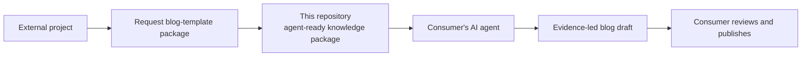
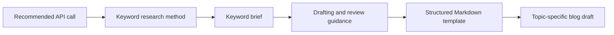
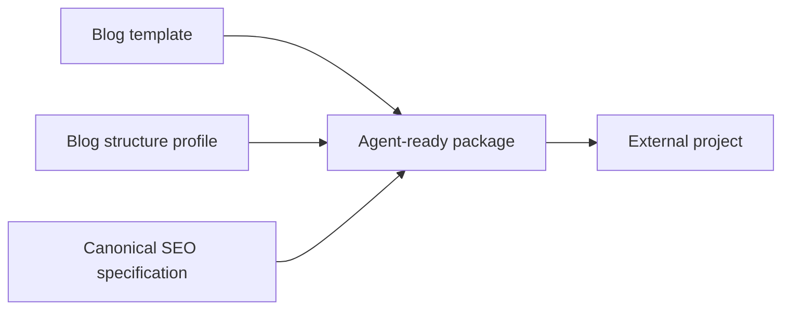
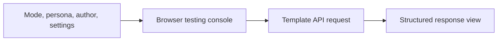
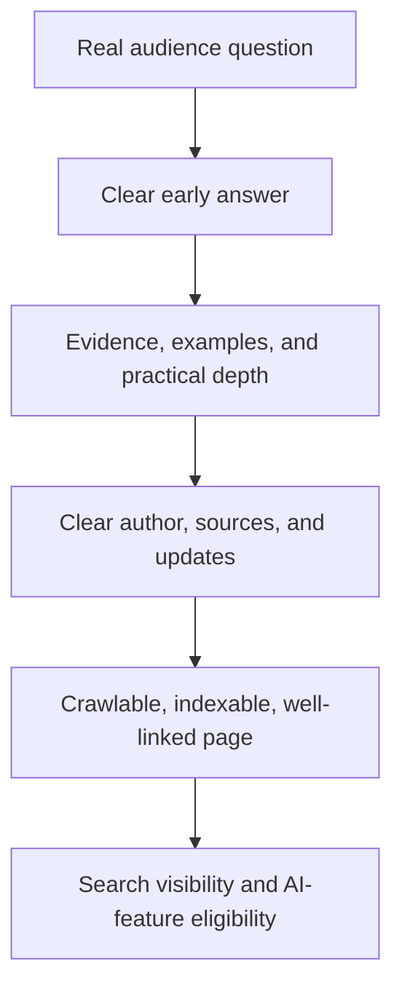
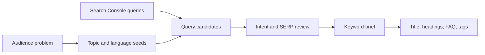
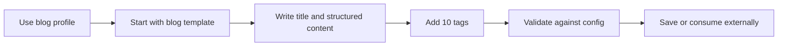

# Reusable Marketing Post Templates

This project defines a portable, Open Knowledge Format (OKF) knowledge package for creating long-form product-marketing blog posts. Blog posts are the active product scope. The earlier social-media material is preserved as deferred reference work and will be redesigned independently later.

The repository does not create or publish posts itself. Its primary consumer is an AI agent in another project: that agent requests this package to obtain the structure and instructions for a good-quality, SEO-ready blog post, then creates the actual topic-specific post in its own project. A human-readable view is retained for understanding, review, and maintenance.

## Consumer model



### AI-agent-first response contract

Every response from this repository—whether delivered through an API, raw files, or a future export—must be optimized first for an AI agent: unambiguous, structured, versioned, and actionable. It must give the requesting agent everything it needs to create a quality blog post without guessing at the repository’s intent:

- active template and structural profile;
- required inputs, constraints, and conditional sections;
- keyword-research workflow, query-selection criteria, and a reusable keyword-brief format;
- drafting and review workflow;
- SEO and Google AI-search guidance grounded in sources;
- quality standards and source-grounded claims;
- a human-readable presentation of the same instructions for planning and approval.

Human readability presents the same agent-facing source of truth in a clearer format for planning and approval.

The API, raw repository files, and future packaged exports deliver this same canonical contract. The consumer's agent applies the supplied keyword-research workflow to its own topic and site data, performs factual verification, and manages its publishing environment and final publication decisions.

### Response scope

This repository and its API return a self-contained blog-creation guidance package: keyword-research instructions, a keyword-brief format, structure, configuration, drafting instructions, review rules, and source-grounded SEO guidance. The requesting project’s AI agent applies that package to its own topic, product context, evidence, blog-post creation, and publishing workflow.

### One-call agent package

Recommendation mode is the default entry point for an external AI agent that asks for the complete method for creating a quality blog post. One response provides the following connected materials:



The agent uses the keyword-research method to create a brief for its assigned topic, maps the selected queries to the article structure, researches and verifies claims, then fills the returned Markdown template and reviews the completed draft against the returned quality guidance.

## How it works

The active authoring path is blog-first:



1. The blog template establishes the main title, ten tags, subtitles, and structured blog body.
2. The blog fixed-recommendations profile defines one baseline for title length, subtitle count and length, body length, body-section count, and tag count.
3. The persona configuration selects the writing style for the post independently from its structure.
4. The canonical specification supplies source-grounded drafting and review guidance.
5. A consuming AI agent receives these as one agent-ready package, creates the actual draft in its own project, and can validate that draft against the blog profile.

### Persona configuration

`config/personas.json` is the shared writing-style layer for every current and future template. The API resolves the selected persona into both the response and the returned Markdown frontmatter, so the receiving agent has an explicit writing-style instruction alongside the post structure.

| Persona | Writing style |
|---|---|
| Persona A (`persona_a`) | Clear, confident, helpful professional writing in plain language. |
| Persona B (`persona_b`) | Cheerful, conversational, energetic, approachable writing. |
| Persona C (`persona_c`) | Direct, practical office-professional writing for decisions and next steps. |

Persona A is the default. A caller can select another persona by sending its ID as the top-level `persona` field in a template request. The persona configuration can grow with additional voice, audience, vocabulary, or formatting definitions while the template interface remains stable.

### Author configuration

`config/authors.json` is the shared author layer for every current and future template. The API resolves the selected author into both the response and the returned Markdown frontmatter, providing an explicit attribution record beside the selected persona and post structure.

| Author | API ID |
|---|---|
| John | `john` |
| Melissa | `melissa` |
| Radovan | `radovan` |

John is the default. A caller selects an author by sending its ID as the top-level `author` field in a template request. This configuration can later hold additional author information while the current interface remains stable.

### Browser testing console

Open the API root URL in a browser to use the built-in testing console. It loads the available personas and authors, runs recommendation or specific-mode requests directly from the page, and presents the returned package in an overview plus expandable guidance, keyword-research, Markdown-template, and raw-JSON sections.



The authoring contract focuses on the main title, post content, and exactly ten tags. How tags are created is outside the template contract.

## Canonical blog SEO and AI-search specification

> **Single source of truth.** This README contains both the visual [human-readable view](#human-readable-view) and the concise [agent-operating view](#agent-operating-view) for the active blog-template milestone. It is working guidance, not yet the final template.

### Human-readable view

Create long-form blog posts that solve a real audience problem, can earn conventional Google Search visibility, and are eligible to be selected as supporting links in Google AI Overviews or AI Mode.

Google does not define a separate AI-Overview writing format and does not guarantee inclusion. Its AI features use core Search ranking and quality systems, so the durable strategy is helpful, original, technically accessible content—not AI-search tricks. See [Google’s AI-features guidance](https://developers.google.com/search/docs/appearance/ai-features) and [generative-AI optimization guide](https://developers.google.com/search/docs/fundamentals/ai-optimization-guide).



#### Recommended article structure

Select the sections that genuinely help the reader and produce a focused article.

| # | Section | What it must accomplish |
|---:|---|---|
| 1 | Search-intent brief | State the intended audience, their real question or problem, and the useful outcome this article promises. This is authoring context, not necessarily published copy. |
| 2 | Main title (`H1`) | Give the article one unique, clear, descriptive title that accurately represents its content. |
| 3 | Direct answer / key takeaway | Answer the central question clearly near the beginning, then explain the answer in depth. |
| 4 | Table of contents | Help readers navigate a long article; include it when the article has enough sections to benefit from it. |
| 5 | Question-led main sections (`H2`) | Organize the article around real sub-questions. Each section should answer its heading directly before adding explanation. |
| 6 | Original value | Provide first-hand experience, testing, concrete examples, proprietary data, screenshots, expert interpretation, or another contribution that is not a generic summary. |
| 7 | Evidence and sources | Support meaningful factual claims with reliable sources; distinguish facts, opinion, assumptions, and uncertainty. |
| 8 | Practical examples or steps | Show the reader how to apply the advice, evaluate options, and handle common mistakes. |
| 9 | Relevant internal links | Link naturally to useful product, documentation, or related-content pages with descriptive anchor text. |
| 10 | Focused FAQ (optional) | Cover only genuine follow-up questions not already answered in the article. Three to five concise Q&As are usually enough when a FAQ is warranted. |
| 11 | Trust and maintenance information | Identify the author and relevant expertise, list a reviewer when appropriate, and show meaningful publication and update dates. |
| 12 | Related next steps | Point to relevant resources or deeper reading. A promotional CTA is optional and remains outside the current content contract. |

#### Useful practices

- Write for people first, with a clear audience and answer they can use.
- Make expertise visible through original work, careful sourcing, and transparent authorship.
- Use real questions as headings when they accurately describe the reader’s need.
- Keep important information as accessible text, supported by relevant images or video where they improve understanding.
- Publish pages that can be crawled and indexed, and connect them through logical internal links.

#### Keyword-research flow



Start with the audience's problem and the language they use. For an established site, include relevant non-branded and branded queries from Google Search Console, then examine impressions, clicks, CTR, and the pages Google already associates with each query. Select one primary query that represents the article's central question and a small set of closely related supporting queries that each earn a distinct, useful section or FAQ answer. Capture the expected reader outcome, current search-result patterns, and evidence the article can contribute before drafting.

#### Google-aligned implementation

- Create substantial, people-first articles with unique value for a defined audience.
- Use concise, descriptive titles, headings, tags, and prose.
- Include FAQ content when genuine follow-up questions improve the article.
- Use structured data that matches visible content and supports an applicable Search feature. Google currently limits FAQ rich-result visibility largely to authoritative government and health sites, while HowTo rich results are deprecated.
- Rely on Google’s foundational SEO guidance for AI-feature eligibility; Google states that AI features need no additional machine-readable files or special markup.

Question-and-answer writing improves articles when it serves readers. Google selects supporting links for AI responses through its Search systems.

#### Publishing requirements outside the Markdown template

The eventual publishing system should map this content to a well-formed web page with a concise descriptive HTML title and meta description, one visually distinct `H1`, semantic HTML and text in the rendered DOM, crawlable internal links, relevant accessible images, accurate visible-content-matching `Article` structured data, and deliberate crawl/index settings. Structured data can enable appropriate appearances. See [Google’s Article markup guide](https://developers.google.com/search/docs/appearance/structured-data/article) and [structured-data policies](https://developers.google.com/search/docs/appearance/structured-data/sd-policies).

The active blog baseline recommends 1,800 body words, 10 sections, an 8-word title, 6-word subtitles, one expert quote, five source citations, three statistics, and a three-question FAQ when it improves coverage. The future dynamic-ranges milestone can introduce configurable values after the fixed template is complete.

### Agent-operating view

Treat this README, `templates/blog-post.md`, and the active `blog` profile as one agent-ready package. Return or consume the applicable parts as explicit fields and instructions so the receiving agent has clear workflow, constraints, and SEO rationale.

#### Required inputs

- Target audience and concrete problem or question.
- Search intent and intended reader outcome.
- Product or site context, when a relevant internal link or example exists.
- Credible primary sources, first-hand experience, original data, testing, or examples.
- Named author and, when relevant, factual reviewer.

#### Keyword research workflow

1. Define the target audience, their concrete problem, the product or site context, and the useful reader outcome.
2. Generate seed queries from the topic, product language, customer questions, support conversations, and domain expertise.
3. When Search Console data is available, collect relevant queries and record impressions, clicks, CTR, associated pages, branded status, and query groups. Prioritize queries that represent the intended audience and reveal a clear opportunity for a more helpful page.
4. Review current search results for promising queries to understand the dominant reader intent, recurring sub-questions, terminology, freshness needs, and the original contribution that will make the article useful.
5. Select one primary query that expresses the article's central question. Select supporting queries that map naturally to a direct-answer section, an `H2`, or a genuine FAQ answer.
6. Produce the keyword brief below before drafting. Use its wording naturally in the title, direct answer, headings, body, FAQ, internal-link anchors, and the ten tags while keeping every element descriptive and reader-focused.

#### Keyword-research output

```yaml
keyword_research:
  primary_query: "{{PRIMARY_QUERY}}"
  supporting_queries:
    - "{{SUPPORTING_QUERY_01}}"
    - "{{SUPPORTING_QUERY_02}}"
    - "{{SUPPORTING_QUERY_03}}"
  audience_language: "{{CUSTOMER_WORDING_AND_TERMS}}"
  search_intent: "{{INFORMATIONAL_COMMERCIAL_OR_OTHER_READER_GOAL}}"
  reader_outcome: "{{USEFUL_RESULT_AFTER_READING}}"
  search_console_evidence: "{{QUERY_METRICS_AND_ASSOCIATED_PAGE_OBSERVATIONS}}"
  search_result_observations: "{{CURRENT_RESULT_PATTERNS_AND_CONTENT_OPPORTUNITY}}"
  section_mapping: "{{PRIMARY_AND_SUPPORTING_QUERY_TO_SECTION_MAPPING}}"
```

Use Google Search Console query and page data as first-party evidence of how the site's audience already discovers it. Its Performance report supports analysis of queries, clicks, impressions, CTR, and associated pages. Combine that evidence with a reader-first assessment of the current results and the article's own original value.

When factual support is unavailable, research the claim, label it as an assumption, or omit it.

#### Required workflow

1. Create one unique, descriptive `H1`.
2. State a direct, useful answer or key takeaway near the beginning.
3. Use question-led `H2` sections based on genuine reader needs.
4. Answer each heading before adding depth, context, or examples.
5. Add original value and support material claims with reliable sources.
6. Include practical guidance and helpful descriptive internal links.
7. Add an FAQ only for valuable follow-up questions not already answered.
8. Provide author, review, and meaningful update information in publishing metadata when available.

#### Review checklist

- Does the article solve the stated reader problem without requiring another search for the essential answer?
- Is it more useful than a generic summary?
- Are factual claims accurate, current, and visibly supported?
- Are author, expertise, limitations, and uncertainty clear where relevant?
- Are titles, headings, tags, and links descriptive rather than keyword-stuffed?
- Is important content available as ordinary text on the rendered page?
- Does it retain one main title and exactly ten tags?

#### Required quality constraints

- Use verified facts, citations, data, testimonials, quotations, product capabilities, and author credentials.
- Build FAQ content, headings, and sections around genuine reader needs and Google’s foundational SEO guidance.
- Select structured data by matching it accurately to visible content and an applicable Search feature.
- Use the fixed word and section recommendations as editorial targets that support a useful article.

#### Primary sources

- [Google: AI features and your website](https://developers.google.com/search/docs/appearance/ai-features)
- [Google: optimizing for generative AI features](https://developers.google.com/search/docs/fundamentals/ai-optimization-guide)
- [Google: helpful, reliable, people-first content](https://developers.google.com/search/docs/fundamentals/creating-helpful-content)
- [Google Search Essentials](https://developers.google.com/search/docs/essentials)
- [Google: title-link best practices](https://developers.google.com/search/docs/appearance/title-link)
- [Google: changes to FAQ and HowTo rich results](https://developers.google.com/search/blog/2023/08/howto-faq-changes)
- [Google Search Console: Performance report queries](https://support.google.com/webmasters/answer/17011259)
- [Google Search Console: common performance-report tasks](https://support.google.com/webmasters/answer/17010961)

## Template layers

| File | Purpose |
|---|---|
| [`templates/blog-post.md`](templates/blog-post.md) | Active standalone canonical blog-post template with YAML inputs and a 10-section Markdown structure. |
| [`config/blog-post-fixed-recommendations.json`](config/blog-post-fixed-recommendations.json) | Active fixed numeric recommendations for the blog-post template. |
| [`config/post-dynamic-ranges.json`](config/post-dynamic-ranges.json) | Preserved future work for configurable numeric ranges. |
| [`templates/post-core.md`](templates/post-core.md) | Preserved legacy shared scaffold; not active for new authoring. |
| [`templates/social-media-post.md`](templates/social-media-post.md) | Preserved deferred draft for a future independent design. |

The active blog baseline uses 1,800 body words, 10 subtitles/sections, an 8-word title, 6-word subtitles, and exactly 10 tags. It also targets one expert quote, five source citations, three statistics, and a three-question FAQ when relevant.

These fixed recommendations provide a research-informed starting point for the basic template. The preserved dynamic-ranges configuration supports the future configurable-values milestone.

## Typical workflow



1. Start with `templates/blog-post.md`.
2. Write the main title and structured blog content.
3. Provide exactly ten tags.
4. Check the post against the fixed recommendations in `config/blog-post-fixed-recommendations.json`.
5. Save the result as an OKF Markdown concept in `posts/` or in an external consuming project.

## Repository structure

```text
post/
├── config/       fixed recommendations and future dynamic ranges
├── templates/    shared core and channel extensions
├── posts/        completed OKF post concepts
├── AGENTS/       agent instructions
└── SPEC.md       OKF v0.2 specification
```

- `SPEC.md` — local copy of the Open Knowledge Format v0.2 specification.
- `config/` — fixed blog recommendations and preserved future dynamic ranges.
- `templates/` — active blog template direction, deferred material, and consumption guidance.
- `posts/` — reserved for completed post concepts.
- `AGENTS/` — instructions for agents researching, drafting, and reviewing posts.

## OKF and portability

Posts use UTF-8 Markdown with YAML frontmatter, following the local [`SPEC.md`](SPEC.md). The format is intentionally plain and portable: another project should be able to copy or retrieve the templates without importing private repository code.

The future integration direction is an API or adapter that can retrieve the canonical blog template and validate its structure. That API should expose this file-based contract rather than replace it. Social-media support will be reconsidered after the blog template is complete.

## API

The initial API is now available locally. Recommendation mode returns the researched fixed blog baseline in one call. Specific mode supports direct settings and a guided session that returns one configuration question at a time. See [`docs/API.md`](docs/API.md) for the endpoints, request flow, and local usage.

## Development status

The initial baseline and bonus API are complete. The active milestone is to finish a canonical, standalone blog template. Social-media template design, post-generation logic, authentication, custom domains, and publishing integrations remain future milestones.

## Tooling

Use [Bun](https://bun.sh/) exclusively for this repository’s package management, scripts, and tests. Run the API with `bun run start` and the test suite with `bun test`. Startup uses local IPv4 port 3000 when available, otherwise the first free port through 3010. Open the printed local address in a browser to see the API discovery page.

For remote deployment, import the repository into Vercel. The included `vercel.json` configures Vercel’s Bun runtime, and the `api/` entrypoints use the same handler as the local server. See [`docs/API.md`](docs/API.md) for the Vercel setup and guided-session secret.

## Collaboration workflow

Repository work is integrated on `develop`. Changes are committed and pushed there incrementally. `main` is reserved for work that has been fully tested and verified.

## Upstream reference

The OKF specification was obtained from [GoogleCloudPlatform/knowledge-catalog](https://github.com/GoogleCloudPlatform/knowledge-catalog/blob/main/okf/SPEC.md).
