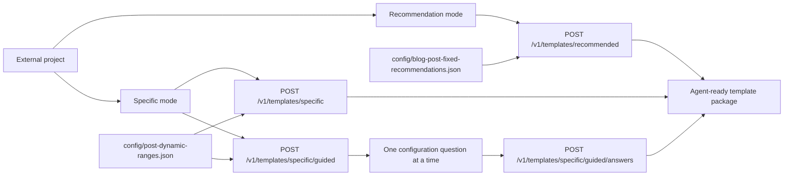
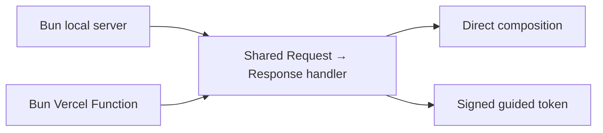

# Post Template API

The API exposes the repository’s reusable template contract in two modes. Recommendation mode returns a complete blog-creation guidance package in one call. Specific mode accepts caller-supplied settings directly or gathers them through a guided flow. Every completed response returns template structure, canonical agent guidance, and reusable placeholders. The requesting project’s AI agent uses the returned package to research and create its own topic-specific post.



## Run locally

```bash
bun run start
```

The API listens on `http://127.0.0.1:3000` by default. Set `PORT` to use a different port.

If port 3000 is already in use, `bun run start` automatically tries ports 3001 through 3010 and prints the active address. Set `PORT` when a caller requires one exact port; an explicitly requested busy port returns a clear startup error. The default host is `127.0.0.1`; set `HOST` deliberately when deployment requires another interface.

Open the root URL in a browser to use the API testing console. It loads the available personas and authors, sends recommendation or specific-mode requests directly from the page, and presents the response as an overview with the selected persona's writing-style effect plus expandable guidance, keyword research, Markdown template, and raw JSON sections. Programmatic clients can request JSON from `GET /` with `Accept: application/json`.

To use guided configuration locally, set a secret with at least 32 characters:

```bash
SESSION_SECRET="replace-with-a-unique-secret" bun run start
```

## Recommendation mode

Call recommendation mode with an empty request body to receive the research-informed baseline for a blog post, the default Persona A writing style, and the default John author record:

```bash
curl -X POST http://127.0.0.1:3000/v1/templates/recommended
```

Select a different writing persona by providing its ID:

```bash
curl -X POST http://127.0.0.1:3000/v1/templates/recommended \
  -H 'Content-Type: application/json' \
  -d '{"persona":"persona_b","author":"melissa"}'
```

The response includes `packageVersion`, the fixed recommendations, an exact resolved configuration, one canonical `template.markdown` field, canonical agent guidance from `README.md#agent-operating-view`, and a dedicated `keywordResearch` field sourced from `README.md#keyword-research-workflow`. Together, these form the self-contained blog-creation guidance package.

| Response field | Agent use |
|---|---|
| `keywordResearch.markdown` | Research the assigned topic, select a primary query and supporting queries, evaluate search intent, and create the structured keyword brief. |
| `guidance.markdown` | Apply the complete drafting, evidence, SEO, AI-search, and review workflow. |
| `fixedRecommendations` and `configuration` | Use the recommended editorial targets for length, sections, tags, evidence, and FAQ coverage. |
| `template.markdown` | Fill the complete keyword brief and article structure with topic-specific, verified content. |
| `persona` | Apply the resolved writing style while drafting the post. |
| `author` | Apply the resolved author record to the post and its attribution metadata. |

The agent performs this method using its own topic, product context, site data, and credible sources. The completed keyword brief is carried in the template YAML with the article inputs.

## Specific mode: direct

Send the post type and any complete or partial configuration override to `POST /v1/templates/specific`.

```json
{
  "postType": "blog",
  "persona": "persona_c",
  "author": "radovan",
  "configuration": {
    "body": {
      "words": { "min": 2500, "max": 3500 }
    }
  }
}
```

The API starts with the selected profile from `config/post-dynamic-ranges.json`, resolves the selected persona from `config/personas.json` and author from `config/authors.json`, applies the supplied overrides, validates every range, and returns the resolved dynamic ranges, writing style, author record, canonical agent guidance, and Markdown template with reusable placeholders for the requesting project’s creation workflow.

Supported post types are `blog` and `social_media` (`social` is accepted as an alias). Tags are fixed at exactly ten, so `tags.count` must be `{ "min": 10, "max": 10 }`.

## Specific mode: guided

Start a guided specific-mode session:

```bash
curl -X POST http://127.0.0.1:3000/v1/templates/specific/guided
```

The response contains the first question and a `sessionToken`. Send that token with each answer:

```bash
curl -X POST http://127.0.0.1:3000/v1/templates/specific/guided/answers \
  -H 'Content-Type: application/json' \
  -d '{"sessionToken":"<session-token>","value":"blog"}'
```

The API asks, in order, for post type, persona, author, body length, title length, subtitle count, subtitle length, body-section count, and tag count. Range questions accept `{ "min": <integer>, "max": <integer> }` or `"default"` to retain the selected profile value. The final response is the composed template with reusable placeholders for the requesting project’s blog-post creation.

## Personas

Retrieve the available persona IDs and names with `GET /v1/personas`. The shared `config/personas.json` file provides the selected persona’s current writing-style instruction to every template type. Persona A (`persona_a`) is clear and helpful professional writing, Persona B (`persona_b`) is cheerful and conversational, and Persona C (`persona_c`) is direct and practical office-professional writing.

## Authors

Retrieve the available author IDs and names with `GET /v1/authors`. The shared `config/authors.json` file provides the selected author record to every template type. John (`john`) is the default author, and Melissa (`melissa`) and Radovan (`radovan`) are available selections.

Guided sessions are signed, short-lived tokens rather than server memory. This keeps the flow valid across separate local processes or Vercel Function invocations. Keep `SESSION_SECRET` private and use the same value for each deployed environment.

## Deploy on Vercel Hobby

This repository includes `vercel.json` and Bun Function entrypoints, so the same handler works locally and on Vercel.



1. Import this repository into Vercel from its Git provider and select the `main` branch for production.
2. Keep the repository root as the project root; `vercel.json` selects the Other framework preset, runs `bun install`, and lets Vercel discover the `api/` functions with the Bun runtime.
3. In **Project Settings → Environment Variables**, add a private `SESSION_SECRET` of at least 32 characters for Production and Preview. Vercel applies environment-variable changes to new deployments only, so redeploy after adding or changing it.
4. Deploy. The production URL exposes the same `/`, `/health`, and `/v1/...` routes shown in this document.

The direct endpoint does not need `SESSION_SECRET`; it is required for the guided session flow.

## Endpoints

| Method | Path | Purpose |
|---|---|---|
| `GET` | `/` | Browser discovery page or JSON endpoint directory. |
| `GET` | `/health` | Service health check. |
| `GET` | `/v1/post-types` | Available post types and built-in dynamic profiles. |
| `GET` | `/v1/personas` | Available writing personas. |
| `GET` | `/v1/authors` | Available authors. |
| `POST` | `/v1/templates/recommended` | Return the researched fixed blog-template package. |
| `POST` | `/v1/templates/specific` | Return a package from caller-supplied settings. |
| `POST` | `/v1/templates/specific/guided` | Start guided specific configuration. |
| `POST` | `/v1/templates/specific/guided/answers` | Answer the next guided specific question with `sessionToken`. |
