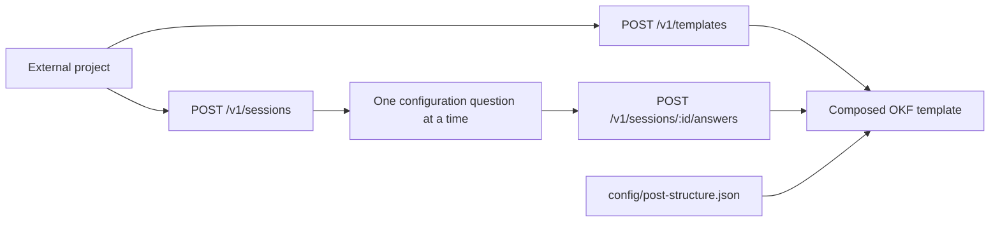

# Post Template API

The API exposes the repository’s template contract through two flows: direct composition and guided configuration.



## Run locally

```bash
npm start
```

The API listens on `http://localhost:3000` by default. Set `PORT` to use a different port.

## Direct composition

Send the post type and any complete or partial configuration override to `POST /v1/templates`.

```json
{
  "postType": "blog",
  "configuration": {
    "body": {
      "words": { "min": 2500, "max": 3500 }
    }
  }
}
```

The API starts with the selected profile from `config/post-structure.json`, applies the supplied overrides, validates every range, and returns the resolved configuration with the core, extension, and combined Markdown template.

Supported post types are `blog` and `social_media` (`social` is accepted as an alias). Tags are fixed at exactly ten, so `tags.count` must be `{ "min": 10, "max": 10 }`.

## Guided configuration

Start a guided session:

```bash
curl -X POST http://localhost:3000/v1/sessions
```

The response contains the first question: post type. Send each answer to the returned session URL:

```bash
curl -X POST http://localhost:3000/v1/sessions/<session-id>/answers \
  -H 'Content-Type: application/json' \
  -d '{"value":"blog"}'
```

The API asks, in order, for post type, body length, title length, subtitle count, subtitle length, body-section count, and tag count. Range questions accept `{ "min": <integer>, "max": <integer> }` or `"default"` to retain the selected profile value. The final response is the composed template.

Guided sessions are stored in memory in this initial implementation; restarting the process clears them.

## Endpoints

| Method | Path | Purpose |
|---|---|---|
| `GET` | `/health` | Service health check. |
| `GET` | `/v1/post-types` | Available post types and built-in profiles. |
| `POST` | `/v1/templates` | Direct template composition. |
| `POST` | `/v1/sessions` | Start guided configuration. |
| `POST` | `/v1/sessions/:id/answers` | Answer the next guided question. |
