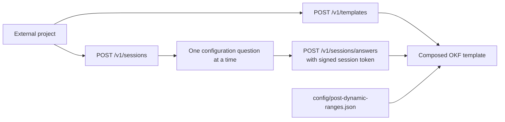
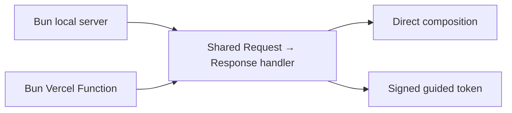

# Post Template API

The API exposes the repository’s reusable template contract through two flows: direct composition and guided configuration. It returns template structure and instructions. The requesting project’s AI agent uses the returned package to research and create its own topic-specific post.



## Run locally

```bash
bun run start
```

The API listens on `http://127.0.0.1:3000` by default. Set `PORT` to use a different port.

If port 3000 is already in use, `bun run start` automatically tries ports 3001 through 3010 and prints the active address. Set `PORT` when a caller requires one exact port; an explicitly requested busy port returns a clear startup error. The default host is `127.0.0.1`; set `HOST` deliberately when deployment requires another interface.

Open the root URL in a browser to view a small API discovery page instead of a route error. Programmatic clients can request JSON from `GET /` with `Accept: application/json`.

To use guided configuration locally, set a secret with at least 32 characters:

```bash
SESSION_SECRET="replace-with-a-unique-secret" bun run start
```

## Direct composition

Send the post type and any complete or partial configuration override to `POST /v1/templates`.

```json
{
  "postType": "blog",
  "configuration": {
    "body": {
      "words": { "min": 2500, "max": 3500 }
    }
  }
}
```

The API starts with the selected profile from `config/post-dynamic-ranges.json`, applies the supplied overrides, validates every range, and returns the resolved dynamic ranges with the core, extension, and combined Markdown template. The canonical README supplies the agent-ready best-practice guidance and source references; the Markdown contains reusable placeholders for the requesting project’s creation workflow.

Supported post types are `blog` and `social_media` (`social` is accepted as an alias). Tags are fixed at exactly ten, so `tags.count` must be `{ "min": 10, "max": 10 }`.

## Guided configuration

Start a guided session:

```bash
curl -X POST http://127.0.0.1:3000/v1/sessions
```

The response contains the first question and a `sessionToken`. Send that token with each answer:

```bash
curl -X POST http://127.0.0.1:3000/v1/sessions/answers \
  -H 'Content-Type: application/json' \
  -d '{"sessionToken":"<session-token>","value":"blog"}'
```

The API asks, in order, for post type, body length, title length, subtitle count, subtitle length, body-section count, and tag count. Range questions accept `{ "min": <integer>, "max": <integer> }` or `"default"` to retain the selected profile value. The final response is the composed template with reusable placeholders for the requesting project’s blog-post creation.

Guided sessions are signed, short-lived tokens rather than server memory. This keeps the flow valid across separate local processes or Vercel Function invocations. Keep `SESSION_SECRET` private and use the same value for each deployed environment.

## Deploy on Vercel Hobby

This repository includes `vercel.json` and Bun Function entrypoints, so the same handler works locally and on Vercel.



1. Import this repository into Vercel from its Git provider and select the `main` branch for production.
2. Keep the repository root as the project root; Vercel discovers the `api/` functions and uses the Bun runtime declared in `vercel.json`.
3. In **Project Settings → Environment Variables**, add a private `SESSION_SECRET` of at least 32 characters for Production and Preview. Vercel applies environment-variable changes to new deployments only, so redeploy after adding or changing it.
4. Deploy. The production URL exposes the same `/`, `/health`, and `/v1/...` routes shown in this document.

The direct endpoint does not need `SESSION_SECRET`; it is required for the guided session flow.

## Endpoints

| Method | Path | Purpose |
|---|---|---|
| `GET` | `/` | Browser discovery page or JSON endpoint directory. |
| `GET` | `/health` | Service health check. |
| `GET` | `/v1/post-types` | Available post types and built-in profiles. |
| `POST` | `/v1/templates` | Direct template composition. |
| `POST` | `/v1/sessions` | Start guided configuration. |
| `POST` | `/v1/sessions/answers` | Answer the next guided question with `sessionToken`. |
