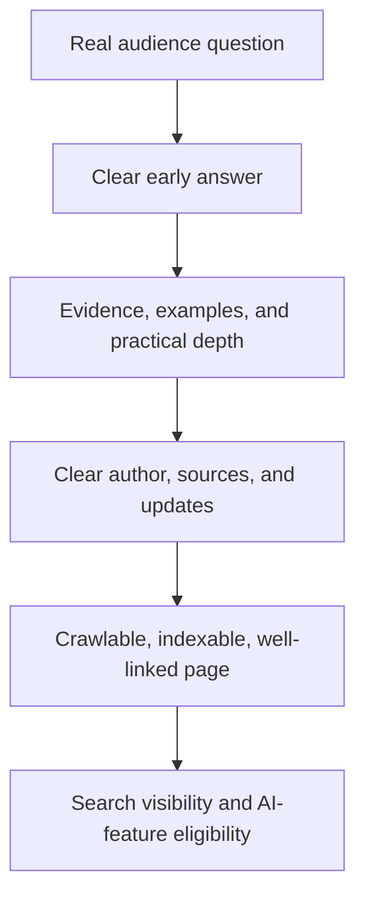

# SEO- and AI-search-ready blog structure

> **Canonical source of truth** for the blog SEO and AI-search structure. It has two views in this one file: a visual [human-readable view](#human-readable-view) and a concise [agent-operating view](#agent-operating-view). This is a working reference for the blog-template milestone, not yet the final template.

## Human-readable view

## Purpose

Create long-form blog posts that help a real audience solve a clear problem, can earn conventional Google Search visibility, and are eligible to be selected as supporting links in Google AI Overviews or AI Mode.

Google does not define a separate AI-Overview writing format and does not guarantee inclusion. Its AI features use core Search ranking and quality systems, so the durable strategy is helpful, original, technically accessible content—not AI-search tricks. See [Google’s AI-features guidance](https://developers.google.com/search/docs/appearance/ai-features) and [generative-AI optimization guide](https://developers.google.com/search/docs/fundamentals/ai-optimization-guide).

## Recommended article structure

Use the sections below as the starting structure for a blog post. Keep only sections that genuinely help the reader; a template must not become filler.

| # | Section | What it must accomplish |
|---:|---|---|
| 1 | Search-intent brief | State the intended audience, their real question or problem, and the useful outcome this article promises. This is authoring context, not necessarily published copy. |
| 2 | Main title (`H1`) | Give the article one unique, clear, descriptive title that accurately represents its content. |
| 3 | Direct answer / key takeaway | Answer the central question clearly near the beginning, then explain the answer in depth. |
| 4 | Table of contents | Help readers navigate a long article; include it when the article has enough sections to benefit from it. |
| 5 | Question-led main sections (`H2`) | Organize the article around real sub-questions. Each section should answer its heading directly before adding explanation. |
| 6 | Original value | Provide first-hand experience, testing, concrete examples, proprietary data, screenshots, expert interpretation, or another contribution that is not a generic summary. |
| 7 | Evidence and sources | Support meaningful factual claims with reliable sources; distinguish facts, opinion, assumptions, and uncertainty. |
| 8 | Practical examples or steps | Show the reader how to apply the advice, evaluate options, or avoid common mistakes. |
| 9 | Relevant internal links | Link naturally to useful product, documentation, or related-content pages with descriptive anchor text. |
| 10 | Focused FAQ (optional) | Cover only genuine follow-up questions not already answered in the article. Three to five concise Q&As are usually enough when a FAQ is warranted. |
| 11 | Trust and maintenance information | Identify the author and relevant expertise, list a reviewer when appropriate, and show meaningful publication and update dates. |
| 12 | Related next steps | Point to relevant resources or deeper reading. A promotional CTA is optional and remains outside the current content contract. |

## What this does—and does not—mean for AI search

### Useful practices

- Write for people first, with a clear audience and an answer they can use.
- Make expertise visible through original work, careful sourcing, and transparent authorship.
- Use real questions as headings when they accurately describe the reader’s need.
- Keep important information as accessible text, supported by relevant images or video where they improve understanding.
- Publish pages that can be crawled and indexed, and connect them through logical internal links.

### Unsupported shortcuts to avoid

- Do not write thin articles solely to capture search traffic.
- Do not keyword-stuff titles, headings, tags, or prose.
- Do not add invented FAQs merely to attract AI answers.
- Do not depend on `FAQPage` or `HowTo` markup for visibility. FAQ rich results are generally limited to authoritative government and health sites, and HowTo rich results are deprecated.
- Do not add `llms.txt`, special AI-only markup, or artificial micro-sections for Google AI features. Google says no special markup or machine-readable files are required.

Question-and-answer writing is valuable when it improves the article for readers. It is not a promise that Google will cite the page in an AI response.

## Publishing requirements outside the Markdown template

The eventual publishing system should map this content to a well-formed web page:

- a concise, descriptive HTML `<title>` and meta description;
- one visually distinct `H1` that matches the article’s subject;
- semantic HTML and text available in the rendered DOM;
- crawlable internal links and descriptive anchor text;
- relevant, accessible images with useful alt text where appropriate;
- accurate `Article` structured data that matches visible content, including genuine author details and relevant images;
- crawlability and indexability, with no accidental `noindex` or robots blocking.

Structured data may enable appropriate search appearances but never guarantees them. It must represent visible, accurate content. See [Google’s Article markup guide](https://developers.google.com/search/docs/appearance/structured-data/article) and [structured-data policies](https://developers.google.com/search/docs/appearance/structured-data/sd-policies).

## Configuration implications

The current 2,000–4,000-word profile is an editorial depth range, not a Google ranking requirement. Google states it has no preferred word count. The final blog configuration should distinguish:

- non-negotiable contract requirements, such as one main title and exactly ten tags;
- editorial ranges, such as total length and section count;
- conditional sections, such as table of contents, FAQ, examples, sources, and author information.

## Agent-operating view

### Scope

- Apply this specification to long-form blog posts only.
- The objective is people-first, evidence-led content that is eligible for normal Google Search and Google AI-feature links.
- Do not promise rankings, AI Overview inclusion, citations, or backlinks.

### Required inputs

- Target audience and concrete problem or question.
- Search intent and intended reader outcome.
- Product or site context, when a relevant internal link or example exists.
- Credible primary sources, first-hand experience, original data, testing, or examples.
- Named author and, when relevant, factual reviewer.

When factual support is unavailable, research the claim, label it as an assumption, or omit it.

### Required workflow

1. Create one unique, descriptive `H1`.
2. State a direct, useful answer or key takeaway near the beginning.
3. Use question-led `H2` sections based on genuine reader needs.
4. Answer each heading before adding depth, context, or examples.
5. Add original value and support material claims with reliable sources.
6. Include practical guidance and helpful descriptive internal links.
7. Add a FAQ only for valuable follow-up questions not already answered.
8. Provide author, review, and meaningful update information in publishing metadata when available.

### Review checklist

- Does the article solve the stated reader problem without requiring another search for the essential answer?
- Is it more useful than a generic summary?
- Are factual claims accurate, current, and visibly supported?
- Are author, expertise, limitations, and uncertainty clear where relevant?
- Are titles, headings, tags, and links descriptive rather than keyword-stuffed?
- Is important content available as ordinary text on the rendered page?
- Does it retain one main title and exactly ten tags?

### Prohibited shortcuts

- Do not invent facts, citations, data, testimonials, quotations, product capabilities, or author credentials.
- Do not add thin FAQs, repeated keywords, `llms.txt`, AI-only markup, or artificial content chunks to influence Google AI features.
- Do not use `FAQPage` or `HowTo` structured data as an expected traffic tactic.
- Treat word and section ranges as editorial targets, never proof of SEO quality.

### Publishing handoff

Recommend—but do not implement without explicit authorization—a concise HTML title and meta description, semantic heading hierarchy, accurate Article structured data, author information, relevant accessible images, crawlability, indexability, and meaningful internal links.

## Primary sources

- [Google: AI features and your website](https://developers.google.com/search/docs/appearance/ai-features)
- [Google: optimizing for generative AI features](https://developers.google.com/search/docs/fundamentals/ai-optimization-guide)
- [Google: helpful, reliable, people-first content](https://developers.google.com/search/docs/fundamentals/creating-helpful-content)
- [Google Search Essentials](https://developers.google.com/search/docs/essentials)
- [Google: title-link best practices](https://developers.google.com/search/docs/appearance/title-link)
- [Google: changes to FAQ and HowTo rich results](https://developers.google.com/search/blog/2023/08/howto-faq-changes)
