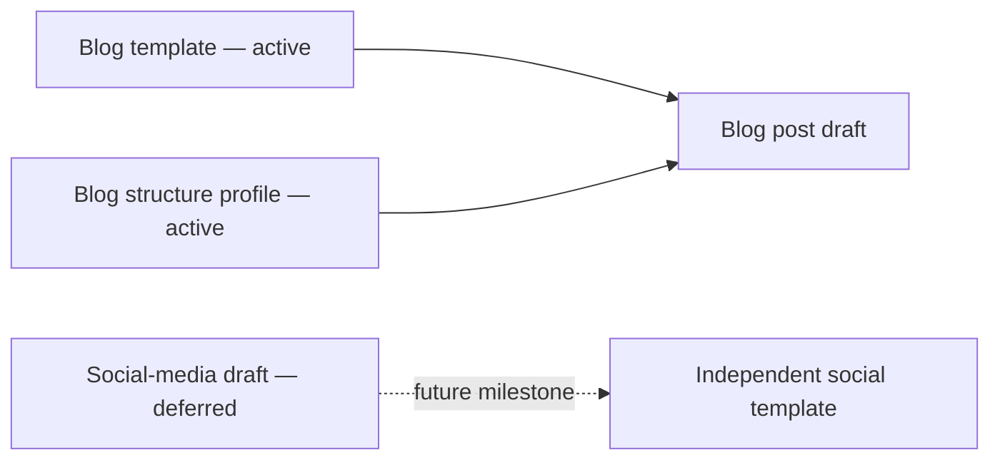

# Templates

## Active scope: blog posts

Blog posts are the only active template work. [`blog-post.md`](blog-post.md) and the fixed recommendations in [`../config/blog-post-fixed-recommendations.json`](../config/blog-post-fixed-recommendations.json) define the current authoring direction.

The blog template is a standalone, canonical blog-post contract. It defines machine-readable authoring inputs in YAML and a researched 10-section Markdown structure for external AI agents.

## Deferred material

- `post-core.md` is preserved as a legacy shared scaffold for compatibility.
- `social-media-post.md` is preserved as an early draft.
- The `social_media` configuration profile is preserved for reference and existing integrations.

Preserve the deferred files during blog-template work. Social media will be reconsidered after the blog template is complete and may use a wholly independent format.

## Minimal content contract

The authoring surface is intentionally minimal:

- `title` — the main title of the post;
- the Markdown body — the post content;
- `tags` — exactly ten tags;
- structure — a main title, subtitles, body sections, and a measurable word-count target.

How the ten tags are created is an implementation detail outside this template contract.

## Structure baselines

The fixed recommendations are defined in [`config/blog-post-fixed-recommendations.json`](../config/blog-post-fixed-recommendations.json), not hardcoded in the templates. The active blog baseline is:

| Template | Target length | Subtitle structure |
|---|---:|---|
| Blog | 1,800 words | 10 subtitles/sections |

Every blog post retains one main title and follows the fixed recommendations. The final word count, title word count, subtitle count, subtitle word count, body-section count, tag count, evidence targets, and FAQ target are available for consumer validation.

## Consumption contract

The template is intentionally plain Markdown and has no runtime dependency. Future API work should expose the blog contract without changing the source format:

- retrieve the canonical blog template;
- read its required YAML inputs and resolved structural recommendations;
- create or fill a blog post from that template;
- validate required OKF metadata and template fields;
- return one designated Markdown template and its guidance for external AI-agent consumption.

The API should be an adapter around this portable file contract, not a replacement for it. External projects must be able to consume the template without importing private repository code. Its preserved social-media endpoint is not an active product commitment.
