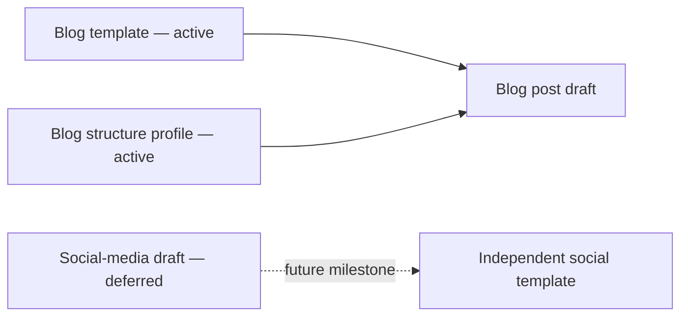

# Templates

## Active scope: blog posts

Blog posts are the only active template work. [`blog-post.md`](blog-post.md) and the `blog` profile in [`../config/post-structure.json`](../config/post-structure.json) define the current authoring direction.

The blog template will be completed as a standalone, canonical blog-post contract. Its design must be led by blog-writing needs, not by an attempt to force common structure with social media.

## Deferred material

- `post-core.md` is preserved as a legacy shared scaffold for compatibility.
- `social-media-post.md` is preserved as an early draft.
- The `social_media` configuration profile is preserved for reference and existing integrations.

Do not remove or expand the deferred files during blog-template work. Social media will be reconsidered after the blog template is complete and may use a wholly independent format.

## Minimal content contract

The authoring surface is intentionally minimal:

- `title` — the main title of the post;
- the Markdown body — the post content;
- `tags` — exactly ten tags;
- structure — a main title, subtitles, body sections, and a measurable word-count target.

How the ten tags are created is an implementation detail outside this template contract.

## Structure baselines

The ranges are defined in [`config/post-structure.json`](../config/post-structure.json), not hardcoded in the templates. The active profile is:

| Extension | Target length | Subtitle structure |
|---|---:|---|
| Blog | 2,000–4,000 words | 5–10 subtitles/sections |

Every blog post must retain one main title and satisfy the blog profile. The final word count, title word count, subtitle count, subtitle word count, body-section count, and tag count should be checkable by a consumer or future API.

## Consumption contract

The template is intentionally plain Markdown and has no runtime dependency. Future API work should expose the blog contract without changing the source format:

- retrieve the current template;
- retrieve the canonical blog template;
- create or fill a blog post from that template;
- validate required OKF metadata and template fields;
- return the Markdown document and its metadata for rendering or channel adaptation.

The API should be an adapter around this portable file contract, not a replacement for it. External projects must be able to consume the template without importing private repository code. Its preserved social-media endpoint is not an active product commitment.
